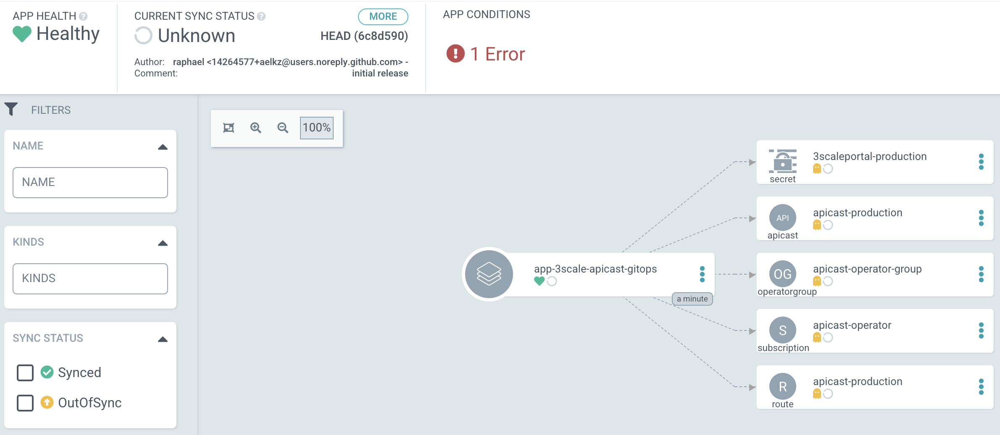
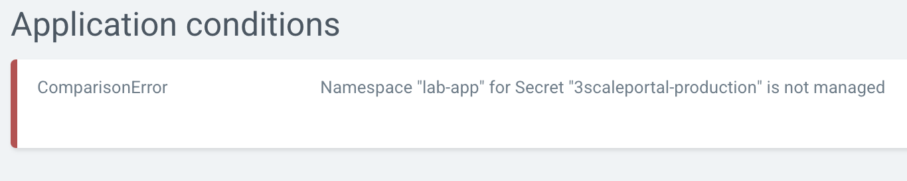

## GitOps demo
`ArgoCD` `Red Hat OpenShift GitOps`

## Installation

### What is GitOps?
from Red Hat:<br>
GitOps is a set of DevOps practices that are used to manage infrastructure and application configurations using the Git open source version control system as a "single source of truth," and is widely used with Kubernetes.
At its core, GitOps maintains that a system must have its desired state expressed declaratively, and that the desired state is versioned and immutable, pulled automatically, and continuously reconciled.
GitOps provides an array of benefits, including standardizing workflows, simplifying tool sets, reducing potential variables and errors, increasing developer productivity, and more.

### What is ArgoCD?
Put simply, ArgoCD is an easy to use tool that allows development teams to deploy and manage applications without having to learn a lot about Kubernetes, and without needing full access to the Kubernetes system. This hugely simplifies the process of running applications in Kubernetes, ultimately leading to better security and increased developer productivity.

`source`<br>
https://www.redhat.com/en/blog/argocd-and-gitops-whats-next<br>
https://argoproj.github.io/cd/

### 01 GitOps managed project

```
oc delete project $APP_NS ; oc new-project $APP_NS --description="Application demo managed by GitOps" --display-name="Application demo managed by GitOps"
```

### 02 Red Hat OpenShift GitOps project

```
export ARGOCD_NS=lab-argocd
export ARGOCD_INSTANCE_NAME=gitops
export APP_NS=lab-app
export APP_NAME=app-3scale-apicast-gitops

oc delete project $ARGOCD_NS ; oc new-project $ARGOCD_NS --description="GitOps Tools" --display-name="GitOps Tools"
```

### 03 Deploy ArgoCD into `$ARGOCD_NS`

```
cat > argocd.yaml <<EOL
apiVersion: argoproj.io/v1alpha1
kind: ArgoCD
metadata:
  name: $ARGOCD_INSTANCE_NAME
  namespace: $ARGOCD_NS
spec:
  controller:
    processors: {}
    resources:
      limits:
        cpu: 2000m
        memory: 2048Mi
      requests:
        cpu: 512m
        memory: 1Gi
  dex:
    openShiftOAuth: true
    resources:
      limits:
        cpu: 500m
        memory: 256Mi
      requests:
        cpu: 250m
        memory: 128Mi
  ha:
    enabled: false
    resources:
      limits:
        cpu: 500m
        memory: 256Mi
      requests:
        cpu: 250m
        memory: 128Mi
  rbac:
    defaultPolicy: ''
    policy: |
      g, system:cluster-admins, role:admin
    scopes: '[groups]'
  redis:
    resources:
      limits:
        cpu: 500m
        memory: 256Mi
      requests:
        cpu: 250m
        memory: 128Mi
  repo:
    resources:
      limits:
        cpu: 1000m
        memory: 1024Mi
      requests:
        cpu: 512m
        memory: 512Mi
  server:
    resources:
      limits:
        cpu: 1000m
        memory: 512Mi
      requests:
        cpu: 500m
        memory: 256Mi
    route:
      enabled: true
  usersAnonymousEnabled: true
EOL
oc apply -f argocd.yaml -n $ARGOCD_NS
```

### 05 Assign role to ArgoCD service account

```
oc get sa -n $ARGOCD_NS
NAME                                   SECRETS   AGE
builder                                2         6m37s
default                                2         6m37s
deployer                               2         6m37s
gitops-argocd-application-controller   2         12s
gitops-argocd-dex-server               2         12s
gitops-argocd-redis-ha                 2         12s
gitops-argocd-server                   2         12s
```
then:
```
oc get sa ; oc policy add-role-to-user cluster-admin system:serviceaccount:$ARGOCD_NS:$ARGOCD_INSTANCE_NAME-argocd-application-controller -n $ARGOCD_NS
oc adm policy add-cluster-role-to-user cluster-admin system:serviceaccount:$ARGOCD_NS:$ARGOCD_INSTANCE_NAME-argocd-application-controller -n $ARGOCD_NS
```

Global cluster write permissions (`cluster-admin`) is not allowed for an operator to be included in the OpenShift Operator Hub.<br>
This is why the decision was made to ship the operator with cluster `read` permissions only and can be overridden by the user using the documentation referenced above if `cluster-admin` is something you need.

### 06 Open ArgoCD console
```
oc get secret $ARGOCD_INSTANCE_NAME-cluster -o json -n $ARGOCD_NS | jq -r '.data."admin.password"' | base64 --decode ; ARGOCD_SERVER_URL=$(oc get routes -n $ARGOCD_NS | grep $ARGOCD_INSTANCE_NAME-server | awk '{print $2}') ; echo '\nhttps://'$ARGOCD_SERVER_URL'\n'
```

PS. `oc extract secret/argocd-cluster -n $ARGOCD_NS --to=-` should work too.

### 07 Create a new application

```
oc delete Application/$APP_NAME ;
cat > argocd-application.yaml <<EOL
apiVersion: argoproj.io/v1alpha1
kind: Application
metadata:
  name: app-3scale-apicast-gitops
  namespace: $ARGOCD_NS
spec:
  destination:
    namespace: $APP_NS
    server: 'https://kubernetes.default.svc'
  project: default
  source:
    path: './20-releases/50-kustomize/lab-app/'
    repoURL: 'https://github.com/aelkz/gitops-demo.git'
    targetRevision: HEAD
  syncPolicy:
    automated:
      prune: true
      selfHeal: true
    syncOptions:
      - Validate=false
      - PruneLast=true
EOL
oc apply -f argocd-application.yaml -n $ARGOCD_NS
```

### Troubleshooting: Namespace "lab-app" for Secret "3scaleportal-production" is not managed





#### PKCS#8 key (used for attaching certificate into routes)

```
openssl req -x509 -utf8 -sha256 -days 3650 -newkey rsa:4096 -keyout key.pem -out cert.pem -nodes
```

#### PKCS#8 to PKCS#1

```
openssl rsa -in key.pem -out key.pem
```
